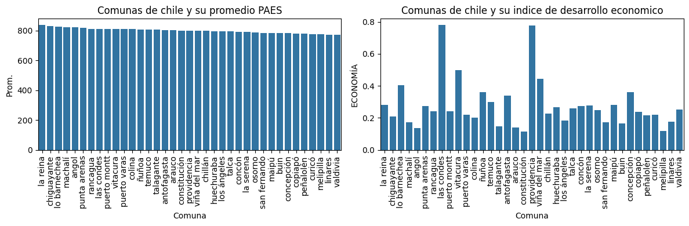
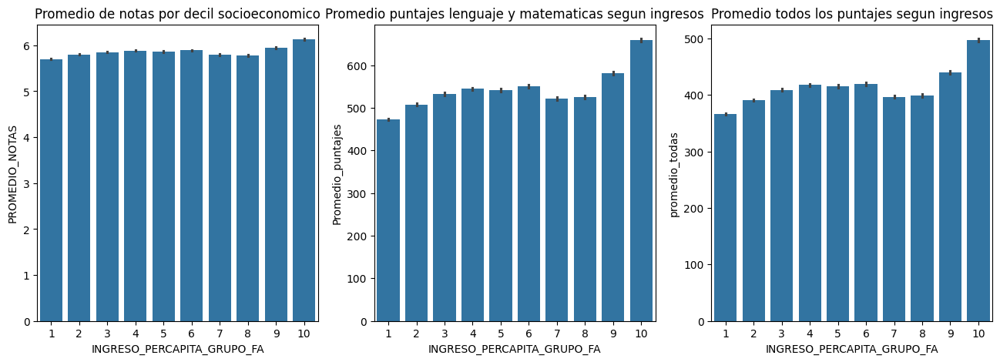
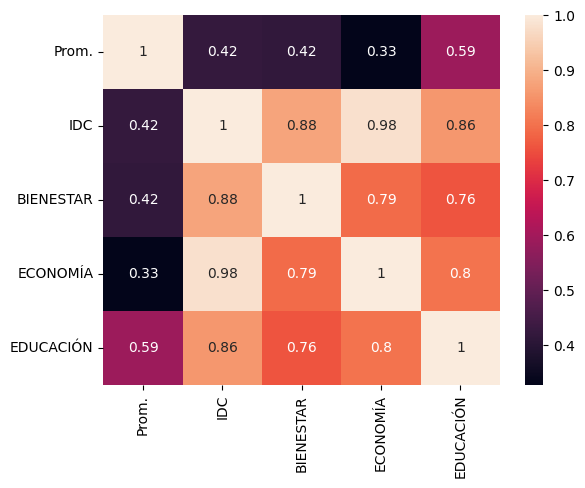
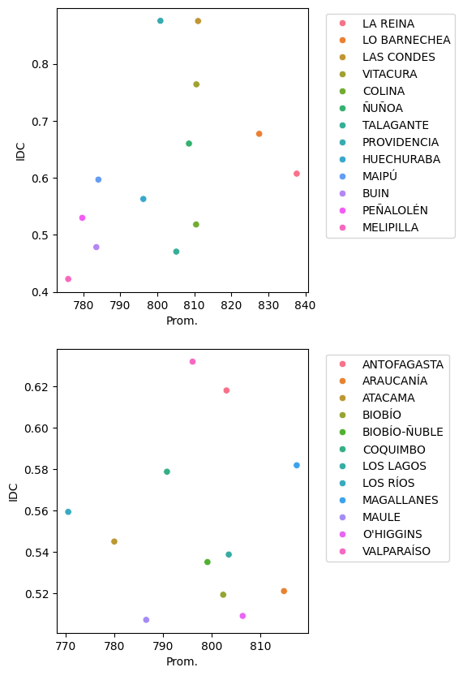
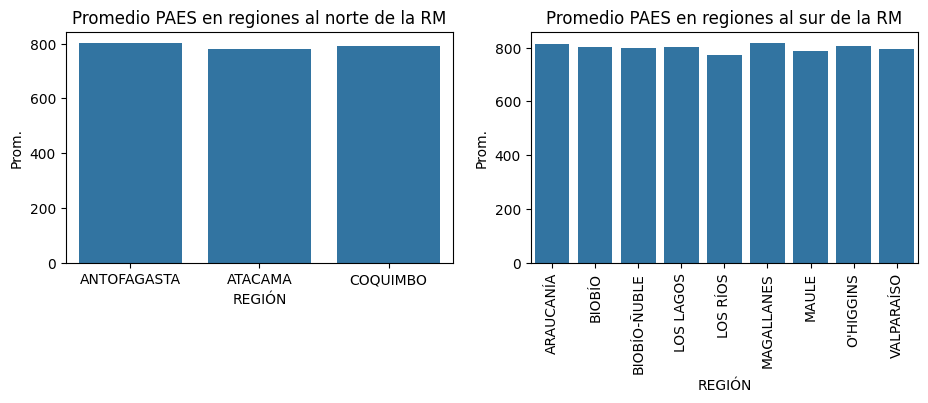
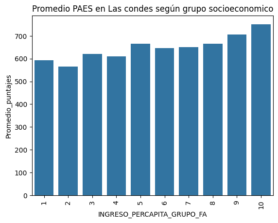

# "Brecha Educativa en Chile: Un Análisis de las Diferencias Geográficas y Socioeconómicas en la Calidad de la Educación"

Hemos hecho un análisis sobre algunos factores que pueden afectar el proceso de admisión a la educación superior en Chile,
específicamente en el periodo de admisión 2023, mirando la relación entre ingresos familiares per capita de los estudiantes,
el índice de desarrollo comunal de las comunas donde viven y estudian, y los resultados individuales  y de los mejores 100 colegios
en la PAES.

Para mayores detalles visite nuestro repositorio en Github: [repositorio](https://github.com/crist0balsoto/Proyecto_Ciencia_de_datos)

## Objetivos

Nuestro objetivos es responder a las siguientes preguntas:
1. ¿Cómo la brecha socioeconómica afecta a la educación en Chile?
2. ¿Hay una fuerte correlación entre índice de desarrollo comunal y puntaje PAES?
3. En base a lo anterior, ¿qué outliers podemos encontrar? ¿Cambia según la región?
4. ¿Influye la proximidad a la Región metropolitana?
5. ¿Qué otros factores pueden afectar el proceso de admisión?

## Resultados

Hemos hecho uso principalmente de resultados que disponibiliza el DEMRE sobre el proceso 2023, del índice de desarrollo comunal de la Universidad autónoma, y del ranking de los 100 mejores colegios por rendimiento en la PAES.

Podemos ver los siguientes gráficos que obtuvimos de la data, que muestran la relación entre los mejores colegios y su IDC:

Y luego tenemos la relación entre decil económico y los distintos aspectos que afectan el ingreso a la educación superior: NEM, Promedio PAES de matemática y lenguaje, y promedio de todas las pruebas rendidas.

De esto observamos que los ingresos familiares per capita son un importante predictor del rendimiento de los alumnos en la PAES, e incluso observamos que entre los alumnos en hogares del decil con mayores ingreso (y en menor menor medida del segundo decil de mayores ingresos) también se genera una ventaja relevante en cuanto a las notas que determinan el NEM.

Luego podemos observar este mapa de calor que grafica la correlación entre el promedio por comuna de los 100 mejores colegios en la PAES y los distintos componentes del IDC de las comunas donde se ubican dichos colegios:

Haciendo uso del coeficiente de determinación ($corr^2$) vemos que la variación entre las comunas en este promedio se explica en un 17,64% por el IDC, y mirando los componentes específicos tenemos un 17,64% por Bienestar, 10,89% por Economía y 34,81% Educación. Es importante señalar aquí, que el componente Educación, según se explica en la metodología de la UA, se incluyen los resultados de la PSU, Simces y matrículas del 2018, por tanto creemos que es más relevante destacar los otros dos componentes, que aunque tengan menor correlación, esta no es despreciable.

Luego nos enfocamos en hallar posibles outliers, para lo cual graficamos la relación IDC-PAES para comunas de Santiago, y luego para regiones:

En cuanto a Santiago, vemos como outliers a Lo Barnechea y La Reina, cuyos IDC son cercanos al promedio de las comunas seleccionadas, pero tienen los mejores puntajes promedio. Esto se puede deber a la desigualdad interna en dichas comuna que son bastantes grandes, teniendo dentro algunos de los colegios más caros del país.

Sobre las regiones, no vemos una correlación destacable, y por tanto no identificamos outliers respecto a esta relación. Esto podría deberse a que se toman regiones enteras y no comunas como en el caso de la RM.

También pasamos a analizar la cercanía a Santiago como posible factor:

Internamente, dentro del sur y del norte no vemos mayores diferencias entre regiones, por tanto descartamos como predictor la cercanía a la capital.

Por último, reforzamos la relevancia de las diferencias socioeconómicas, sobre lo cual vemos que independientemente de la comuna del alumno, el ingreso familiar per capita sigue siendo muy relevante:

## Consideraciones importantes

Este análisis presenta dificultades propias, como inaccesibilidad del público común a información más completa.
Al agrupar regiones, se corre el riesgo de perder la diversidad intrínseca de cada zona, afectando la precisión de las conclusiones sobre la influencia geográfica en los puntajes educativos.
A su vez, los datos socioeconómicos pueden ser limitados para capturar la complejidad de las situaciones individuales, lo que podría impactar las conclusiones. 
También es importante tener en cuenta que a priori no podemos saber a ciencia cierta cuáles son las variables que mejor nos ayudarán a predecir el rendimiento de los alumnos en este proceso a las cuales tenemos acceso, y la selección de algunas que nos parecen relevantes como aquí se basan en hipótesis solamente.
Por último, una posible simplificación excesiva en las conclusiones sobre la influencia socioeconómica en los puntajes podría subestimar la complejidad de los factores educativos.
Es importante también considerar que, a pesar de presentar datos accionables a expertos pertinentes, existe el riesgo de que estos puedan pasar por alto o ignorar el análisis realizado. La interpretación y la aplicación de los datos pueden variar entre expertos, lo que puede influir en la implementación de acciones basadas en los hallazgos presentados.

